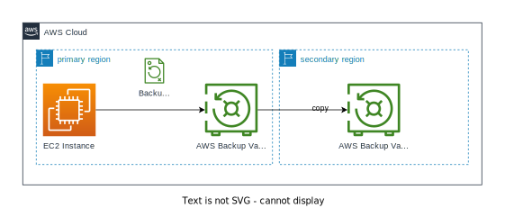

# Backup & Restore Reference Architecture

This project provides a practical implementation of the disaster recovery (DR) strategy "Backup & Restore" outlined in the [AWS Disaster Recovery Whitepaper](https://aws.amazon.com/whitepapers/aws-disaster-recovery/). It demonstrates this using an installation of the open-source web content management system "WordPress" on an Amazon EC2 instance, and by using the AWS Backup service.

## Overview

This repository contains a CDK project designed to help you set up a single EC2 instance running WordPress and configure AWS Backup for daily backups with a 35-day retention period, copied to a secondary AWS regions.

## Prerequisites

Before deploying this solution, ensure you have the following prerequisites:

- AWS CLI installed and configured with necessary IAM permissions.
- AWS CDK installed.
- An AWS account and AWS CLI configured with your access and secret keys.

## Deployment

To deploy this project, make sure all dependencies are installed by running `npm install` and then run `cdk deploy --all`
After deploying the CDK stack, you can access your WordPress site and ensure that AWS Backup is creating and retaining backups in both regions. 

The restore process can be iniated using AWS Backup in the AWS Console as explained in the [AWS Backup Documentation](https://docs.aws.amazon.com/aws-backup/latest/devguide/whatisbackup.html). 

In the `examples` folder you can find a script that automates the restore process and measures the RTA.

## Cleanup

To avoid incurring additional charges, you can remove the resources created by this CDK stack by running `cdk destroy --all`. Make sure you have deleted all recovery-points in the AWS Backup vaults before destroying the stack.

## Additional Information

For a deeper understanding of disaster recovery best practices, refer to the [AWS Disaster Recovery Whitepaper](https://aws.amazon.com/whitepapers/aws-disaster-recovery/). Specifically, focus on the "Backup and Restore" section of the whitepaper for comprehensive guidance on creating a robust backup and recovery strategy.

For more information on AWS CDK and AWS Backup, consult the following resources:

- [AWS CDK Documentation](https://docs.aws.amazon.com/cdk/latest/guide/home.html)
- [AWS Backup Documentation](https://docs.aws.amazon.com/aws-backup/latest/devguide/whatisbackup.html)

## License

This project is licensed under the MIT License - see the [LICENSE](LICENSE) file for details.

